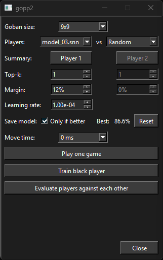
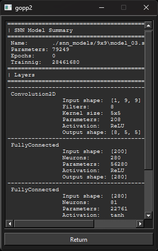
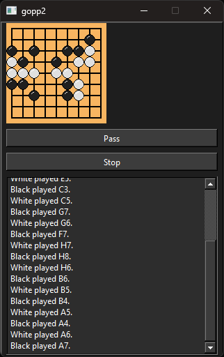
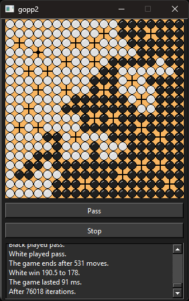

# gopp2
A simple go game, developed in C++ Syntax 2. This software's future goal is to be able to train an AI to play go but, for the moment the AI models are not even 20 kyu.

## Presentation
This inferface is designed to run on a Raspberry PI with a 320x480 screen.

 
 

## License

[Apache License 2.0](LICENSE)

## References

This project has been developed thanks to:

 - clang version 18.1.6, Target: x86_64-pc-windows-msvc
 - cmake version 3.23.1
 - Sutter, H. cppfront [Computer software]. https://github.com/hsutter/cppfront
