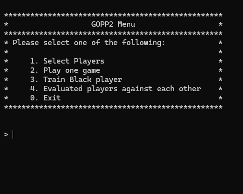
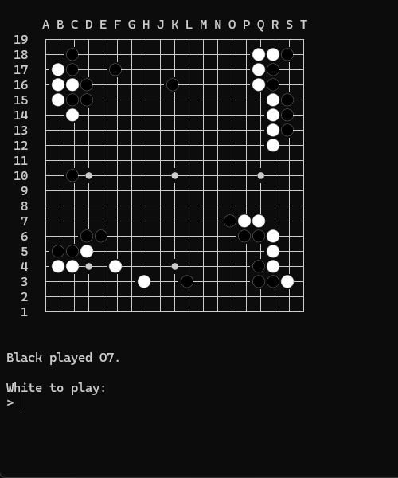
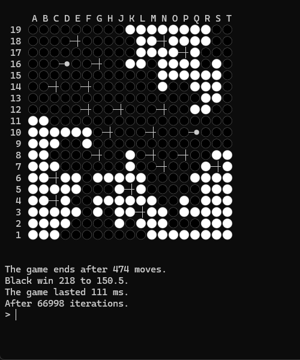

# gopp2
A simple command-line go game, developed in C++ Syntax 2. This software's future goal is to be able to train an AI to play go but, for the moment it's only possible to play against random.

## Presentation

 

## License

[Apache License 2.0](LICENSE)

## References

This project has been developed thanks to:

 - clang version 18.1.6, Target: x86_64-pc-windows-msvc
 - cmake version 3.23.1
 - Sutter, H. cppfront [Computer software]. https://github.com/hsutter/cppfront
